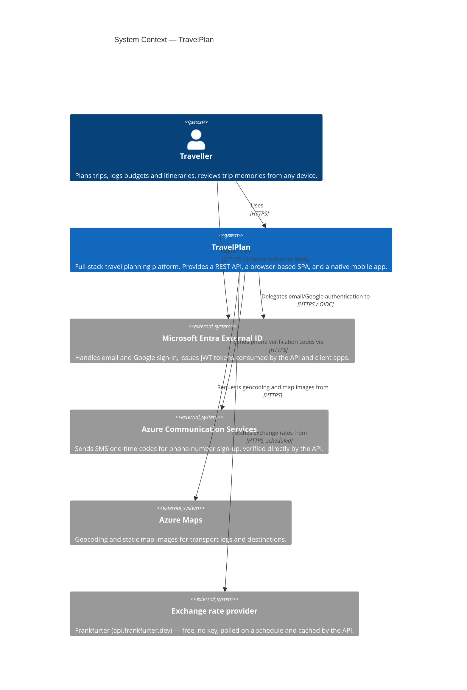
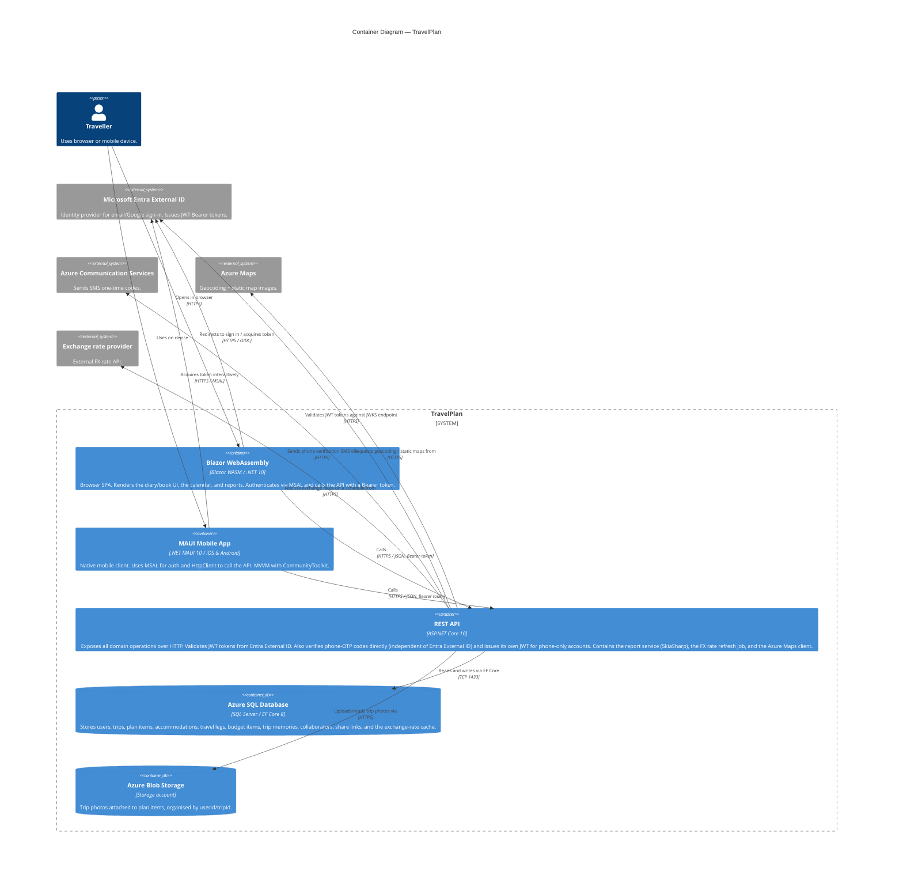

# Architecture — C4 Model (v2)

Updates `architecture.md` per `TravelPlan-Project-Plan-v2.md`. Diagrams use
[Mermaid C4 notation](https://mermaid.js.org/syntax/c4.html).

---

## Level 1 — System Context

**Note**: Azure AD B2C, previously the auth provider here, has been unavailable for
new tenants since May 2025. Microsoft Entra External ID is the current equivalent
product and fills the same role.

---

## Level 2 — Container Diagram

---

## Key design decisions

| Decision | Choice | Rationale |
|---|---|---|
| Target framework | .NET 10 (LTS), not .NET 8 | .NET 8 reaches end of support November 10, 2026; .NET MAUI 8 and 9 are already out of support today — only .NET MAUI 10 (paired with .NET 10) is currently supported. Switched early, while only the shared library existed. |
| Shared library | `TravelPlan.Shared` referenced by all projects | Single source of truth for DTOs, models, and validators. Eliminates duplication between API and clients. |
| Auth strategy | Microsoft Entra External ID (prod) + dev-bypass handler (dev) | Azure AD B2C stopped accepting new tenants in May 2025; External ID is the current equivalent product, same architectural role. The dev bypass allows local development without configuring a tenant. |
| Phone sign-up | Custom OTP flow via Azure Communication Services, independent of Entra External ID | Entra's phone-primary sign-up is still immature/custom-config-only; a self-built OTP flow keeps the "quick signup" UX fully in our control. |
| Database per environment | SQLite (dev) / Azure SQL (prod) | Zero-config local setup; Azure SQL for production scalability and managed backups. |
| Plan items | Single `PlanItems` table with nullable `Date`/`Time` instead of separate itinerary and wishlist tables | One item moves between backlog → dated → timed states by filling in fields — matches the drag-and-drop UX without a schema change per state. |
| Sharing model | `TripCollaborators` (named invite) + `TripShareLinks` (anonymous link), each carrying a role | Mirrors Google Docs-style permissions — Owner/Editor/Viewer, with or without an account. |
| Report generation | SkiaSharp draws once to a canvas, producing both PNG and PDF; a separate Razor template produces the HTML view | Avoids a headless-browser dependency while still supporting three export formats (HTML, PDF, image) from one data source. |
| Mobile → API only | MAUI calls the REST API directly | Avoids a second backend surface area; the API is the single data contract for all clients. |
| CI solution filter | `TravelPlan.CI.slnf` excludes Mobile | MAUI requires Android/iOS SDK workloads not available on `ubuntu-latest` runners. |
| Report storage | JSON blob in `TripMemories.ReportData`, discriminated by `ReportType` | Avoids a schema migration every time the report structure evolves; one table serves both the itinerary report and the memory summary. |
