# Entity Relationship Diagram — Azure SQL Schema (v2)

Updates `erd.md` per `TravelPlan-Project-Plan-v2.md` §3. All tables are created by EF
Core migrations targeting Azure SQL (SQL Server). The development SQLite database
uses the same schema.

---

## Diagram

```mermaid
erDiagram

    Users {
        int         Id                PK
        nvarchar36  ExternalAuthId    UK "Microsoft Entra External ID object ID; nullable for phone-only accounts"
        nvarchar256 Email             UK "nullable for phone-only accounts"
        nvarchar20  PhoneNumber       UK "nullable, E.164 format"
        datetime2   PhoneVerifiedAt   "nullable"
        nvarchar100 DisplayName
        datetime2   CreatedAt         "DEFAULT GETUTCDATE()"
        datetime2   UpdatedAt         "DEFAULT GETUTCDATE()"
    }

    Trips {
        int         Id                PK
        int         UserId            FK
        nvarchar200 Title
        nvarchar    Description       "nullable"
        nvarchar20  Status            "Draft|Planned|Active|Completed|Cancelled"
        date        StartDate
        date        EndDate
        nvarchar3   Currency          "nullable"
        decimal182  TotalBudget       "nullable"
        datetime2   CreatedAt         "DEFAULT GETUTCDATE()"
        datetime2   UpdatedAt         "DEFAULT GETUTCDATE()"
    }

    Destinations {
        int         Id                PK
        int         TripId            FK
        int         UserId            FK
        nvarchar200 Name
        nvarchar3   CountryCode       "ISO 3166-1 alpha-2/3"
        date        EntryDate
        date        ExitDate          "nullable"
        nvarchar    Notes             "nullable"
    }

    PlanItems {
        int         Id                PK
        int         TripId            FK
        int         DestinationId     FK "nullable"
        date        Date              "nullable — null means trip-level backlog"
        time        Time              "nullable — date set with null time shows as unscheduled on that day"
        nvarchar200 Title
        nvarchar    Notes             "nullable"
        int         SortOrder
        nvarchar500 SourceUrl         "nullable — origin link for quick-capture items"
        bit         IsDone
    }

    Accommodations {
        int         Id                PK
        int         TripId            FK
        int         DestinationId     FK "nullable"
        nvarchar200 Name
        nvarchar500 Address           "nullable"
        datetime2   CheckIn
        datetime2   CheckOut
        nvarchar100 ConfirmationCode  "nullable"
        nvarchar    Notes             "nullable"
    }

    TravelLegs {
        int         Id                PK
        int         TripId            FK
        nvarchar200 DepartureLocation
        nvarchar200 ArrivalLocation
        datetime2   DepartureTime
        datetime2   ArrivalTime
        nvarchar20  TransportType     "Flight|Train|Bus|Car|Ferry|Other"
        nvarchar100 ConfirmationCode  "nullable"
        nvarchar    Notes             "nullable"
    }

    BudgetItems {
        int         Id                PK
        int         TripId            FK
        nvarchar30  Category          "Transport|Accommodation|Food|Activities|Insurance|Visa|Shopping|Other"
        nvarchar500 Description
        decimal182  Amount
        nvarchar3   Currency          "DEFAULT USD"
        date        Date
        bit         IsPaid
    }

    TripMemories {
        int         Id                PK
        int         TripId            FK
        int         UserId            FK
        nvarchar20  ReportType        "Itinerary|MemorySummary"
        nvarchar200 Title
        nvarchar    Description       "nullable"
        nvarchar    ReportData        "JSON payload — TripReportDto"
        datetime2   CreatedAt         "DEFAULT GETUTCDATE()"
    }

    TripCollaborators {
        int         Id                PK
        int         TripId            FK
        int         UserId            FK
        nvarchar10  Role              "Editor|Viewer"
        datetime2   InvitedAt         "DEFAULT GETUTCDATE()"
        datetime2   AcceptedAt        "nullable — null until the invited user signs up/accepts"
    }

    TripShareLinks {
        int         Id                PK
        int         TripId            FK
        nvarchar64  Token             UK
        nvarchar10  Role              "Viewer|Editor"
        datetime2   ExpiresAt         "nullable"
        datetime2   CreatedAt         "DEFAULT GETUTCDATE()"
    }

    ExchangeRates {
        int         Id                PK
        nvarchar3   BaseCurrency
        nvarchar3   QuoteCurrency
        decimal182  Rate
        datetime2   FetchedAt
    }

    PhoneVerifications {
        int         Id                PK
        nvarchar20  PhoneNumber
        nvarchar6   Code
        datetime2   ExpiresAt
        int         Attempts
        datetime2   CreatedAt         "DEFAULT GETUTCDATE()"
    }

    Users        ||--o{ Trips             : "owns"
    Users        ||--o{ Destinations      : "visited"
    Users        ||--o{ TripMemories      : "has"
    Users        ||--o{ TripCollaborators : "collaborates on"

    Trips        ||--o{ Destinations      : "includes"
    Trips        ||--o{ PlanItems         : "has"
    Trips        ||--o{ Accommodations    : "has"
    Trips        ||--o{ TravelLegs        : "has"
    Trips        ||--o{ BudgetItems       : "tracks"
    Trips        ||--o{ TripMemories      : "generates"
    Trips        ||--o{ TripCollaborators : "shared with"
    Trips        ||--o{ TripShareLinks    : "has"

    Destinations ||--o{ Accommodations    : "hosts"
    Destinations ||--o{ PlanItems         : "covers"
```



`ExchangeRates` and `PhoneVerifications` are standalone caches — not tied to a trip
or a specific user by foreign key.

---

## Delete behaviour

| Relationship | On parent delete |
|---|---|
| Users → Trips | **Cascade** |
| Users → Destinations | No action (soft ownership) |
| Users → TripMemories | No action |
| Users → TripCollaborators | **Restrict** — app deletes a user's `TripCollaborators` rows explicitly before deleting the `Users` row |
| Trips → Destinations | **Cascade** |
| Trips → PlanItems | **Cascade** |
| Trips → Accommodations | **Cascade** |
| Trips → TravelLegs | **Cascade** |
| Trips → BudgetItems | **Cascade** |
| Trips → TripMemories | **Cascade** |
| Trips → TripCollaborators | **Cascade** |
| Trips → TripShareLinks | **Cascade** |
| Destinations → Accommodations | **Restrict** — app nulls out `DestinationId` on a destination's `Accommodations` explicitly before deleting the `Destinations` row |
| Destinations → PlanItems | **Restrict** — app nulls out `DestinationId` on a destination's `PlanItems` explicitly before deleting the `Destinations` row |

> **Why `Users → TripCollaborators` is Restrict, not Cascade**: `Users → Trips`
> and `Trips → TripCollaborators` are both cascade, so a direct cascade from
> `Users → TripCollaborators` as well would create two cascade paths to the same
> table — SQL Server rejects this at migration time (SQLite doesn't enforce it,
> so this only surfaces once the Azure SQL provider is used). The `Trips →
> TripCollaborators` cascade still covers the normal case of a trip being
> deleted; the app only needs to explicitly clean up a user's collaborator rows
> when deleting the `Users` row itself.
>
> **Why `Destinations → Accommodations`/`PlanItems` are Restrict, not Set null**:
> the same multiple-cascade-paths shape — `Trips → Accommodations`/`PlanItems`
> direct Cascade, plus `Trips → Destinations` Cascade → `Destinations →
> Accommodations`/`PlanItems` — both reaching the same table from `Trips`. Also
> only caught once migrations first ran against real SQL Server (Session 9), not
> at design time. Deleting a whole trip is unaffected — the direct `Trips →
> Accommodations`/`PlanItems` cascade already covers it. There's no
> Destinations-delete endpoint yet; when one ships, it must explicitly null out
> `DestinationId` on the destination's `Accommodations`/`PlanItems` first.

---

## Indexes

| Table | Index columns | Notes |
|---|---|---|
| Users | `ExternalAuthId` | Unique, nullable-safe (filtered index) |
| Users | `Email` | Unique, nullable-safe (filtered index) |
| Users | `PhoneNumber` | Unique, nullable-safe (filtered index) |
| Trips | `(UserId, Status, StartDate)` | Composite — supports filtered list queries |
| Destinations | `(UserId, CountryCode, EntryDate)` | Composite — supports history/travel map queries |
| BudgetItems | `(TripId, Category)` | Composite — supports budget summary aggregation |
| PlanItems | `(TripId, Date)` | Composite — supports the calendar/day-view queries; `Date IS NULL` rows are the backlog |
| TripShareLinks | `Token` | Unique — lookup on share-link access |
| PhoneVerifications | `PhoneNumber` | Supports the verify-code lookup |

---

## ReportData JSON structure

`TripMemories.ReportData` stores a serialised `TripReportDto` (nvarchar max). Which
sections populate depends on `TripMemories.ReportType`: an `Itinerary` report always
has an empty `Reflection`; a `MemorySummary` report is only generated once, on trip
completion, and includes it.

```
TripReportDto
├── ReportType           Itinerary | MemorySummary
├── GeneratedAt          datetime
├── Trip                 ReportTripHeaderDto
│   ├── Id, Title, Description, StartDate, EndDate, DurationDays
├── Destinations[]       ReportDestinationDto
│   ├── Name, CountryCode, EntryDate, ExitDate, Nights
├── PlanItems[]          ReportPlanItemDto
│   ├── Date, Time, Title, Notes
├── BudgetSummary        ReportBudgetSummaryDto
│   ├── GrandTotal, Currency
│   └── Categories[]     ReportBudgetCategoryDto  (Category, Total, Percentage)
├── Accommodations[]     ReportAccommodationDto
│   ├── Name, Address, CheckIn, CheckOut, Nights, ConfirmationCode
├── TravelLegs[]         ReportTravelLegDto
│   ├── TransportType, DepartureLocation, ArrivalLocation
│   ├── DepartureTime, ArrivalTime, DurationMinutes, ConfirmationCode
├── Companions[]         string[]
└── Reflection           string  "nullable — user-written text, MemorySummary only"
```
